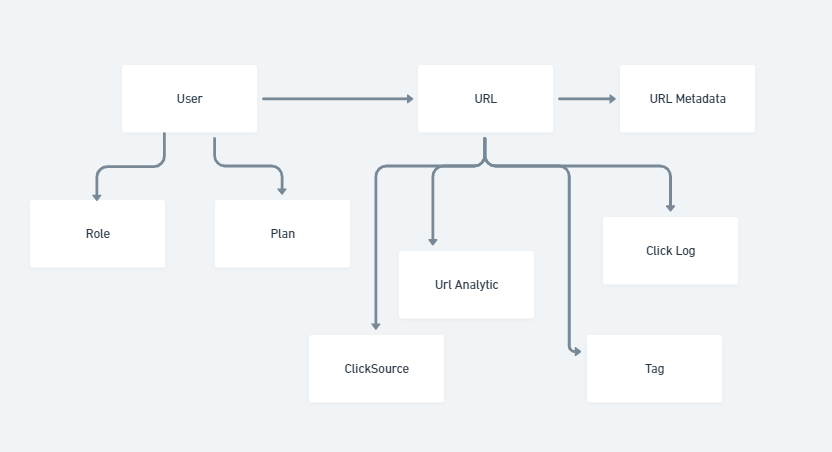

<h2 align="center">url-shortener</h2>

### About

URL Shortener is a backend application that provides a URL shortening service.


### Stack

- **[NodeJS](https://nodejs.org/en)**: 20.x
- **[NestJs](https://nestjs.com/)**: ^10.0.0
- **[TypeOrm](https://typeorm.io/)**: ^0.3.20
- **[PostgreSQL](https://www.postgresql.org/)**: ^8.12.0

### Features

- URL shortening
- Click count on shortened URLs

### How to Run the Project

#### Prerequisites

- **[NodeJS](https://nodejs.org/en)**: 20.x
- **[Docker](https://www.docker.com/)** 

#### Run in Docker

1. Clone:
   ```bash
   git clone https://github.com/jonlima/url-shortener.git
   ```
2. Install the dependencies:
   ```bash
   npm install
   ```
3. Run:
   ```bash
   npm run start:docker
   ```


> [!NOTE]  
>
> When running in start:docker mode, the application will execute the migrations and create the tables, so don't worry about the database.


### Routes

##### **URLs Module**

| **Route**           | **Method** | **Request Body**                                                     | **Response Body**                             | **Headers**                                  |
|---------------------|------------|----------------------------------------------------------------------|-----------------------------------------------|----------------------------------------------|
| `/`                 | `POST`     | `{ "originalUrl": "string" }`                                        | `{ "id": "number", "shortUrl": "string" }`    | None                                         |
| `/:hash`            | `GET`      | None                                                                 | `{ "url": "string" }`                         | None                                         |


### Documentation

How to access and generate project documentation (Swagger and Compodoc).

- Access the API documentation (Swagger) at: `/doc` or `/doc/json`
- Online access [here](https://jonlima.github.io/url-shortene)

**Compodoc**:

Run
```bash
npm run compodoc
```

> [!NOTE]
>
> The generated documentation will be saved in the `docs` folder


### Entity-Relationship (ER) model (Complete)


### Future Scope



### Autor

[](https://www.linkedin.com/in/jonathalima/)